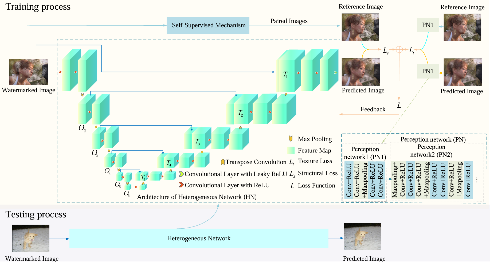
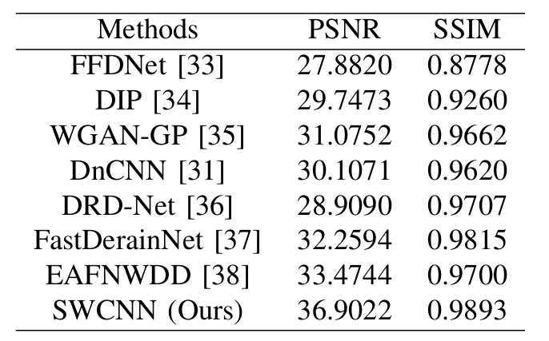
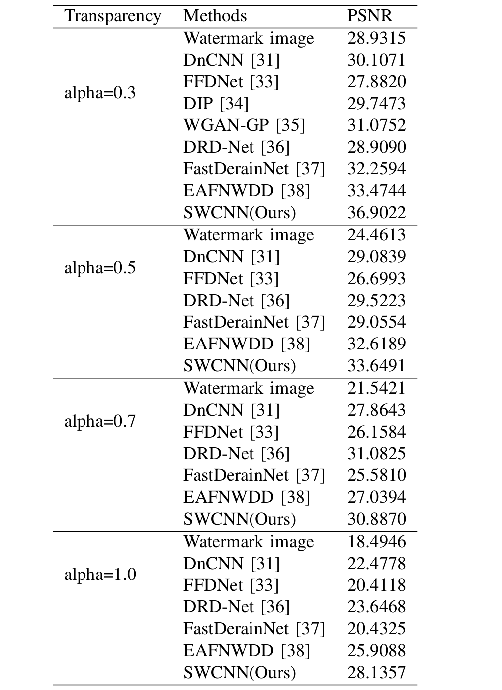
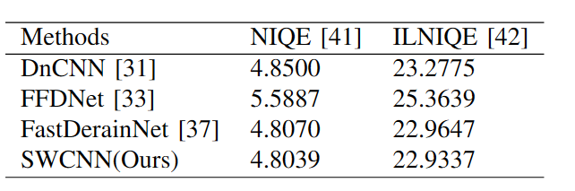
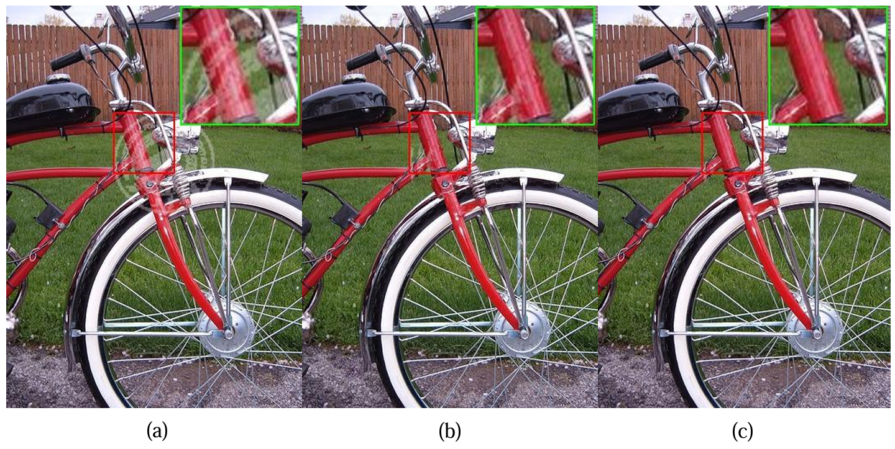
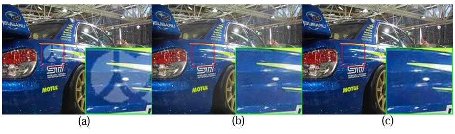
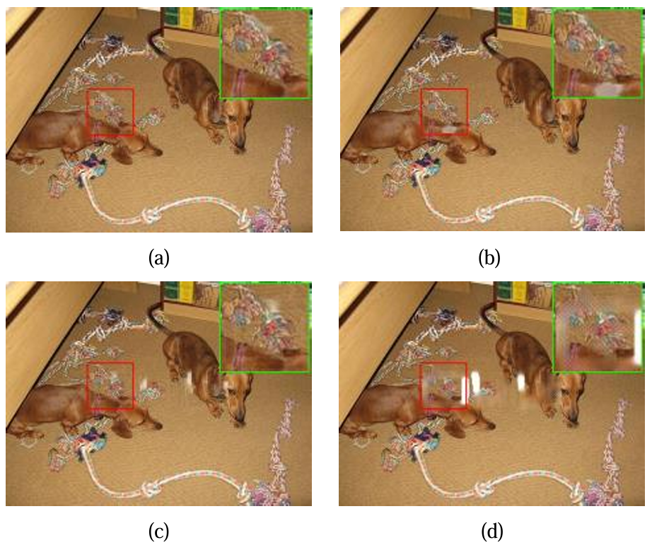
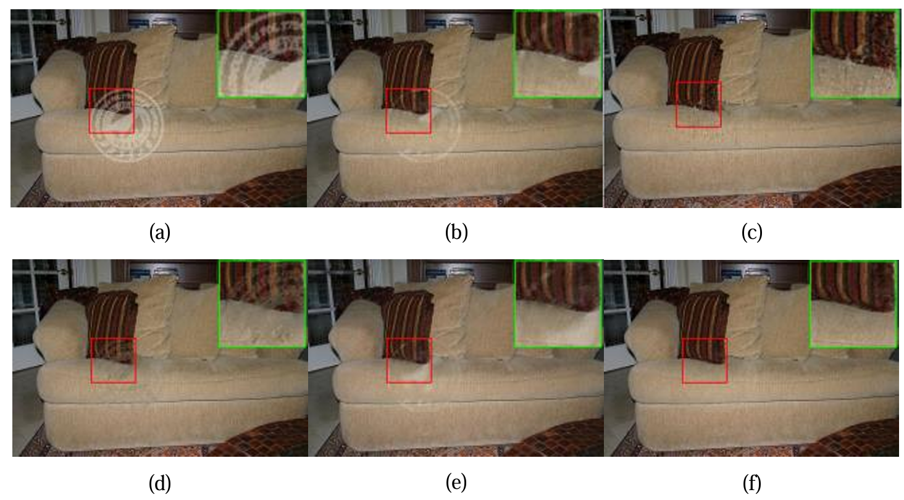
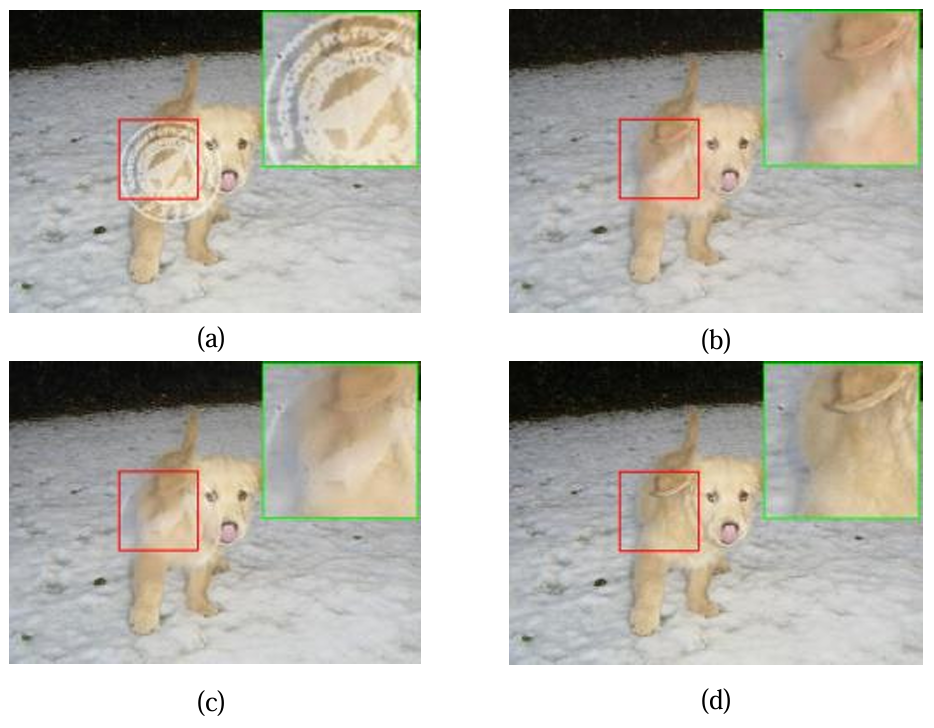

## This paper as well as  A self-supervised CNN for image watermark removal is conducted by Chunwei Tian, Menghua Zheng, Tiancai Jiao, Wangmeng Zuo, Yanning Zhang, Chia-Wen Lin. This  paper is accepted by the IEEE Transactions on Circuits and Systems for Video Technology (IF:8.4) and it is implemented by Pytorch. 

## Its abstract is shown as follows.

## Popular convolutional neural networks mainly use paired images in a supervised way for image watermark removal. However, watermarked images do not have reference images in the real world, which results in poor robustness of image watermark removal techniques. In this paper, we propose a self-supervised convolutional neural network (CNN) in image watermark removal (SWCNN). SWCNN uses a self-supervised way to construct reference watermarked images rather than given paired training samples, according to watermark distribution. A heterogeneous U-Net architecture is used to extract more complementary structural information via simple components for image watermark removal. Taking into account texture information, a mixed loss is exploited to improve visual effects of image watermark removal. Besides, a watermark dataset is conducted. Experimental results show that the proposed SWCNN is superior to popular CNNs in image watermark removal.

## Requirements (Pytorch)

* pytorch==1.11.0
* tensorboard==2.9.1
* scikit-image==0.19.3
* pyyaml==5.1
* h5py==3.7.0
* opencv-python==4.6.0
* matplotlib==3.5.2

## DataSet

### Training datasets

#### The training dataset of the PASCAL VOC 2021 can be obtained at https://pjreddie.com/projects/pascal-voc-dataset-mirror/

### Training datasets

#### The training dataset of the PASCAL VOC 2012 can be obtained at 链接：https://pan.baidu.com/s/1At7c2egxalV1T8HpBGGQdw (56r7)

## Command

Download model file at 链接：链接：https://pan.baidu.com/s/1UbnK2F1FuIMKvqESNk5SvA  (passwd: jlbv) and put `data`/  into `SWCNN/`

### Test

python test.py --alpha 0.3  --loss L1 --self_supervised True  --PN True  --display False

### Train

python train.py --net HN --loss L1 --self_supervised True --PN True --alpha 0.3

## 1. Network architecture of SWCNN.

## 2. Removing watermark performance of different methods for transparency of 0.3. 

## 3. PSNR(dB) of different methods for different transparency. 

## 4. NIQE and ILNIQE of different methods for transparency of 0.3.

## 5. Visual images of different methods

### 6. Visual images of different methods.

### 7. Visual images of different methods.

### 8. Visual images of different methods.

### 9. Visual images of different methods.

## You can cite this paper by the following ways.

### 1. Chunwei Tian, Menghua Zheng, Tiancai Jiao, Wangmeng Zuo, Yanning Zhang, Chia-Wen Lin. A self-supervised CNN for image watermark removal[J]. IEEE Transactions on Circuits and Systems for Video Technology, 2024.

### 2.@article{tian2024A,
       title={A self-supervised CNN for image watermark removal},
       author={Tian, Chunwei and Zheng, Menghua and Jiao, Tiancai and Zuo, Wangmeng and Zhang, Yanning and Lin, Chia-Wen},
       journal={IEEE Transactions on Circuits and Systems for Video Technology},
      year={2024},
     publisher={IEEE}
}
